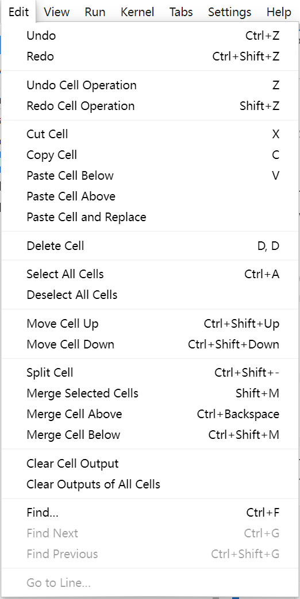

# 这个笔记本怎么用

> 本教程节选自[第0课：简介](第0课/简介.ipynb)

为了让这个笔记本跑起来，你得搭建一个合适的环境。本节内容就是一个教程，手把手教你安装和运行我们推荐的编辑器，也就是 JupyterLab。

## 配置环境

JupyterLab 是一个基于网页的交互式开发环境，适用于代码和数据处理。我们的课程推荐使用 JupyterLab 来运行 Python 代码，并与之交互。[Anaconda](https://www.anaconda.com/) 就包含了 JupyterLab 在内，这是一个很流行的 Python 发行版，包含了许多常用的科学计算软件包。最丝滑的 Anaconda 下载方式位于 [Anaconda 官方下载页面](https://www.anaconda.com/download/success)，从这个页面可以直接获取下载链接而不用注册账号。


左边这个按钮下载的是 Anaconda，而右边的按钮下载的是 Miniconda。Anaconda 是一个完整的发行版，会占用至少 5 GB 的空间。如果你的电脑空间不够，可以考虑装一个 Miniconda。Miniconda 是一个最小的发行版，只包含 Python、conda、还有其他必要的工具，通常只占用不到 500 MB 的空间，但你需要手动安装各种软件包。

如果你对任何细节还有问题，可以先去看看 [Anaconda 官方教程](https://www.anaconda.com/docs/getting-started/getting-started)有没有你需要的答案。

装好 Anaconda 之后，你会看到 Anaconda Navigator，这是一个图形化的 Anaconda 环境管理器。打开 Anaconda Navigator，你就能找到 JupyterLab 这个应用，然后点击“Launch”这个按钮就能启动。


如果你的 Python 环境不是 Anaconda，那你可能需要手动安装 JupyterLab 和其他依赖。还好我们提供了一个最小依赖列表，就是这个 `requirements.txt`。你可以在终端里运行以下命令来安装依赖：

```shell
pip install -r requirements.txt
```

在装好依赖之后，你就可以用以下命令来启动 JupyterLab 了：

```shell
jupyter lab
```

这个命令会在浏览器里打开一个新页面，然后跳转到 JupyterLab 的界面（通常位于 <http://localhost:8888/lab>）。

## 使用 JupyterLab

JupyterLab 提供了灵活而符合直觉的界面用于与笔记本交互，这个界面看起来有点像 [Visual Studio Code](https://code.visualstudio.com/)（VS Code）。你可以阅读 [JupyterLab 用户指导](https://jupyterlab.readthedocs.io/en/stable/user/interface.html)以了解 JupyterLab 的更多特性。接下来让我们简要了解一下 JupyterLab 的界面。


- 顶部的**菜单栏**包含一系列菜单，用于控制界面和笔记本，并附有快捷键提示。
- **左侧栏**包含文件浏览器、内核监视器、笔记本目录和扩展管理器。
- **主界面**包含笔记本的编辑器，代码都是在这里编写和运行的。
- **右侧栏**包含元数据查看器和代码调试器。
- 底部的**状态栏**展示了当前的笔记本、内核等信息。

### 笔记本的组成

Jupyter 的笔记本由若干单元格组成，主要分为代码单元格和 Markdown 单元格。要创建一个单元格，你需要选中你想要创建单元格位置上方的单元格。选中后，左侧会出现一条蓝色的竖线。然后，你就可以点击工具栏上的“+”按钮，在选中单元格的下方创建一个新单元格。


代码单元格用于编写和执行 Python 代码。就像我们在示例 1 里提到的那样，你可以按 <kbd>Shift</kbd> + <kbd>Enter</kbd> 快捷键（在 Mac 上是 <kbd>Shift</kbd> + <kbd>Return</kbd>），或者点击工具栏里的“Run”按钮来运行代码。


代码单元格可能会在底下显示代码的输出，这些输出可以是文本、图片或其他媒体形式。当你选中一个包含输出的代码单元格，左侧的蓝线会在单元格和输出的边界处断开。


Markdown 单元格用于编写文本内容，我们稍后就会学到 Markdown 是如何用简单的语法渲染出丰富的样式。


要编辑 Markdown 单元格，你只需要双击该单元格就能进入编辑模式。当你完成编辑后，“执行”该单元格（记住这个快捷键或按钮）就能看到渲染结果。


对了，把光标移到你感兴趣的按钮上，就能看到这个按钮的说明，以及对应的快捷键（如果有的话）。还有，你可以通过工具栏的下拉菜单来改变某个单元格的类型（代码、Markdown 或原始文本）。


当你选中一个单元格，它的右上角会浮现出一系列小控件，每一个控件都对应下表列出的一个单元格操作：

| Widget                                                 | Description | Default Shortcut                                 |
|--------------------------------------------------------|-------------|--------------------------------------------------|
|       | 复制当前单元格     | None                                             |
|            | 把当前单元格往上移一格 | <kbd>Ctrl</kbd>+<kbd>Shift</kbd>+<kbd>Up</kbd>   |
|        | 把当前单元格往下移一格 | <kbd>Ctrl</kbd>+<kbd>Shift</kbd>+<kbd>Down</kbd> |
|  | 在上方插入新的单元格  | <kbd>A</kbd>                                     |
|  | 在下方插入新的单元格  | <kbd>B</kbd>                                     |
|              | 删除单元格       | <kbd>D</kbd>, <kbd>D</kbd> (double press)        |

除了快捷键或按钮，你也可以直接按住单元格的左侧空白区域来拖动它们。以及，按住 <kbd>Shift</kbd> 再点击单元格可以进行多选，然后你可以同时移动这些选中的单元格。

### 菜单栏

现在让我们仔细看看菜单栏：它让你可以控制整个界面和笔记本。以下是你正式使用 JupyterLab 之前应该了解的关键内容。

文件菜单（File）允许你打开、保存和创建新的笔记本，你还可以把笔记本导出为多种格式。以下是一些重要的快捷键和功能：
- <kbd>Ctrl</kbd>+<kbd>S</kbd> 用于保存你的笔记本，当然你也可以在设置中启用自动保存。
- <kbd>Alt</kbd>+<kbd>W</kbd> 用于关闭当前笔记本，因为 <kbd>Ctrl</kbd>+<kbd>W</kbd> 已经被浏览器用来关闭标签页了。
- 子菜单“Save and Export Notebook As”允许你以多种格式保存你的笔记本，包括 HTML、PDF 和 Markdown。
- 要创建一个新的笔记本，展开“New”子菜单并选择“Notebook”。


编辑菜单（Edit）允许你编辑笔记本，包括剪切、复制、粘贴，以及撤销/重做。以下是一些重要的快捷键和功能：
- 就像大部分文本编辑器一样，<kbd>Ctrl</kbd>+<kbd>Z</kbd> 和 <kbd>Ctrl</kbd>+<kbd>Shift</kbd>+<kbd>Z</kbd> 用于撤销和重做单元格内部的编辑。
- 对应地，那些不含 <kbd>Ctrl</kbd> 的快捷键则用于单元格操作，例如：
    - <kbd>Z</kbd> 用于撤销最近的单元格操作。
    - <kbd>Shift</kbd>+<kbd>Z</kbd> 重做最近撤销的单元格操作。
    - <kbd>X</kbd>、<kbd>C</kbd> 和 <kbd>V</kbd> 用于剪切、复制和粘贴单元格。



运行菜单（Run）允许你运行和调试笔记本，包括运行单个或所有单元格，以及重启内核。在大部分情景下，你只需要记住 <kbd>Shift</kbd>+<kbd>Enter</kbd> 是运行当前单元格就够了。如果你打算渲染所有 Markdown 单元格，或者在不重启内核的前提下运行所有代码，那就需要从这个菜单里访问对应的选项了。


内核菜单（Kernel）允许你启动、关闭、重启和更换内核。目前，你可以把内核当成执行代码和渲染 Markdown 的后台进程。当你在执行代码时遇到问题时，通常的对策包括重启内核，清理输出，以及从头运行代码。前述功能都可以在这个菜单找到。


## 关于 Jupyter Notebook

你们可能听说过 Jupyter Notebook，这也是一个基于网页的交互式开发环境。在 JupyterLab 问世前，Jupyter Notebook 就是默认的 Jupyter 界面。不过现在我们已经不再推荐使用了，因为最新版本的 Jupyter Notebook 就是基于 JupyterLab 构建的，并且在将来很可能就直接并入 JupyterLab 了。


## 其他集成开发环境（IDE）

市面上还存在许多针对 Python 设计的 IDE，例如 [PyCharm](https://www.jetbrains.com/pycharm/)，[VS Code](https://code.visualstudio.com/)，以及 [Spyder](https://www.spyder-ide.org/)。这些 IDE 都是为了不同的用途定制的，你可以根据需求自行选择。
